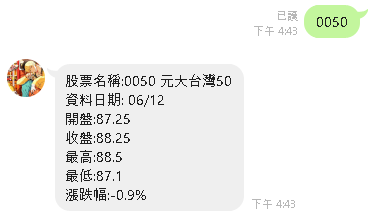
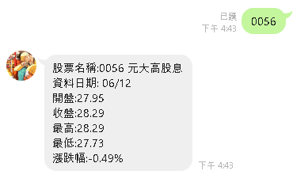

#### 安裝所需套件
`pip install -r requirements.txt`

#### 透過requests套件來實作功能
- requests.post(): 將資料加入POST請求中

#### 透過BeautifulSoup套件來實作功能
- BeautifulSoup(): 解析HTML程式碼
- soup.find_all(): 找出所有特定的HTML標籤節點

#### 透過Flask套件來實作功能
- app = Flask(__name__): 創建Flask類的實例

#### 透過os套件來實作功能
- port = int(os.environ.get('PORT',5000)): 綁定端口為5000

#### 透過Heroku來部署
所需文件: 
- Procfile: 如何運行Web App，在這邊我們使用gunicorn這個WSGI Server。
- runtime.txt: 使用的Python 版本
- requirements.txt: Python 套件清單，告訴Heroku需要安裝哪些套件

#### 透過ngrok來測試
- ngrok http 5000

#### 程式說明
使用Python語言撰寫股票爬蟲程式來製作LineBot，以Flask框架+ Heroku來部署

透過使用者輸入"股票代號"來查看該股票資訊: 開盤、收盤、最高、最低...等

在此以個人有投資的股票: 0050與0056當作範例來測試

後續可新增其他功能，如:新聞資訊、油價資訊、電影資訊...等

#### 執行結果

